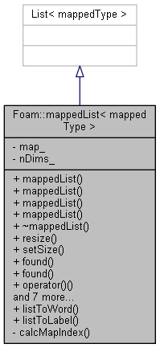

# mappedList

1. [mappedList](#mappedlist)
   1. [mappedList.H](#mappedlisth)
      1. [Description](#description)
      2. [Include](#include)
      3. [Inherit](#inherit)
      4. [Private data and member functions](#private-data-and-member-functions)
      5. [Constructors and destructor](#constructors-and-destructor)
      6. [Public member functions](#public-member-functions)
         1. [Static member function](#static-member-function)
         2. [Mmodifiers](#mmodifiers)
         3. [Access](#access)
   2. [mappedListI.H](#mappedlistih)
   3. [mappedLists.H](#mappedlistsh)
   4. [mappedList.C](#mappedlistc)
      1. [Static Member Functions](#static-member-functions)
      2. [Constructors](#constructors)
         1. [Constructor 1](#constructor-1)
         2. [Constructor 2](#constructor-2)
         3. [Constructor 3](#constructor-3)
         4. [Constructor 4](#constructor-4)
      3. [Destructor](#destructor)
      4. [Member functions](#member-functions)
         1. [calcMapIndex](#calcmapindex)
         2. [setSize](#setsize)
         3. [resize](#resize)
         4. [found 1](#found-1)
         5. [found 2](#found-2)

## mappedList.H

### Description

Stores a list, with a `Map<label>` that takes a label key and returns the index into the list.

    Example

        Lookup  |  Label Key | Index
         0 0 0         0         0
         1 0 0       100         1
         0 1 0        10         2
         0 0 1         1         3
         2 0 0       200         4
         2 1 0       210         5

The `operator ()` is overloaded in order to hide the above mapping.



### Include

```cpp
#include "scalar.H"
#include "vector.H"
#include "labelList.H"
#include "Map.H"
```

### Inherit

```cpp
template <class mappedType>
class mappedList
:
    public List<mappedType>
```

Inherit from `List`.

### Private data and member functions

```cpp
// Private data

    //- Map from the label to its index within the List
    Map<label> map_;

    //- Number of dimensions
    label nDims_;

// Private Member Functions

    //- Returns an element provided the indeces of the order
    label calcMapIndex(std::initializer_list<label> indexes) const;

```

Declare private data and member function:

* `map_`: Map from the label to its index within the List;
* `nDims_`: Number of dimensions;
* `calcMapIndex(std::initializer_list<label> indexes) const`: Returns an element provided the indeces of the order.

### Constructors and destructor

```cpp
public:

// Constructors

    //- Construct from size and labelListList
    mappedList
    (
        const label size,
        const labelListList& indexes
    );

    //- Construct from size and labelListList with initial value for
    //  all elements
    mappedList
    (
        const label size,
        const labelListList& indexes,
        const mappedType& initValue
    );

    //- Construct from size and map with initial value for all elements
    mappedList
    (
        const label size,
        const Map<label>& map,
        const mappedType& initValue
    );

    //- Construct from List<mappedType> and labelListList
    mappedList
    (
        const List<mappedType>& initList,
        const labelListList& indexes
    );


//- Destructor
~mappedList();
```

Declare four constructors and one destructor.

### Public member functions

#### Static member function

```cpp
// Static member functions

    //- Convert a list of labels to a word. {1, 2, 3} -> 123
    static word listToWord(const labelList& lst);

    //- Convert a list of labels to a single label. {0, 2, 3} -> 23
    static label listToLabel
    (
        const labelList& lst,
        const label nDims = 0
    );
```

Declare two static functions to convert a list of labels to a word or to a single label.

#### Mmodifiers

```cpp
// Modifiers

    //- Resize mapped list
    void resize(const label newSize);

    //- Set mapped list size
    void setSize(const label newSize);
```

Declare two functions to resize mapped list and set mapped list size.

#### Access

```cpp
// Access

    //- Is label list index used
    bool found(const labelList& l) const;

    //- Is label list index used
    template <typename ...ArgsT>
    bool found(ArgsT ...args) const;

    //- Non-const access to a moment given the list of orders
    template <typename ...ArgsT>
    inline mappedType& operator()(ArgsT ...args);

    //- Const access to a moment given the list of orders
    template <typename ...ArgsT>
    inline const mappedType& operator()(ArgsT ...args) const;

    //- Constant access given a label list
    inline const mappedType& operator()(const labelList& l) const;

    //- Non-constant access given a label list
    inline mappedType& operator()(const labelList& l);

    //- Returns const access to the moment map
    inline const Map<label>& map() const;
```

Declare **seven** member functions to access to private data:

* `found(const labelList& l) const`: Is label list index used;
* `found(ArgsT ...args) const`: Is label list index used;
* `operator()(ArgsT ...args)`: Non-const access to a moment given the list of orders;
* `operator()(ArgsT ...args) const`: Const access to a moment given the list of orders;
* `operator()(const labelList& l) const`: Constant access given a label list
* `operator()(const labelList& l)`: Non-constant access given a label list;
* `map() const`: Returns const access to the moment map.

## mappedListI.H

```cpp
template <class mappedType>
template <typename ...ArgsT>
mappedType& Foam::mappedList<mappedType>::operator()(ArgsT ...args)
{
    // calculate map index with the argument
    label mapIndex = calcMapIndex({args...});
    // In fact, these functions convert [] to () 
    return this->operator[](map_[mapIndex]);
}

template <class mappedType>
template <typename ...ArgsT>
const mappedType&
Foam::mappedList<mappedType>::operator()(ArgsT ...args) const
{
    Foam::label mapIndex = calcMapIndex({args...});

    return this->operator[](map_[mapIndex]);
}

template <class mappedType>
const mappedType& Foam::mappedList<mappedType>::operator()
(
    const Foam::labelList& l
) const
{
    // first conver list to a single label and then get element
    return this->operator[](map_[listToLabel(l, nDims_)]);
}

template <class mappedType>
mappedType& Foam::mappedList<mappedType>::operator()
(
    const Foam::labelList& l
)
{
    return this->operator[](map_[listToLabel(l, nDims_)]);
}

template <class mappedType> const Foam::Map<Foam::label>&
Foam::mappedList<mappedType>::map() const
{
    // return map_
    return map_;
}
```

Define four member functions that overlaod `()` and `map()`. They all are defined as function template. 

## mappedLists.H

```cpp
typedef mappedList<label> mappedLabelList;
typedef mappedList<scalar> mappedScalarList;
typedef mappedList<vector> mappedVectorList;
```

Rename type of mappedList:

* mappedLabelList
* mappedScalarList
* mappedVectorList

## mappedList.C

Two static member functions, four constructors, a destructors, and five member functions(tow modifiers, two access and a private member function) are defined here.

### Static Member Functions

```cpp
template <class mappedType>
Foam::word
Foam::mappedList<mappedType>::listToWord(const labelList& lst)
{
    word w;

    forAll(lst, dimi)
    {
        // a string-like w
        w += Foam::name(lst[dimi]);
    }

    return w;
}

template <class mappedType>
Foam::label
Foam::mappedList<mappedType>::listToLabel
(
    const labelList& lst,
    const label nDims
)
{
    label l = 0;
    label size = max(nDims, lst.size());

    forAll(lst, dimi)
    {
        // conver to a lable as a number
        l += lst[dimi]*pow(scalar(10), size - dimi - 1);
    }

    return l;
}
```

### Constructors

#### Constructor 1

```cpp

```

#### Constructor 2

```cpp

```

#### Constructor 3

```cpp

```

#### Constructor 4

```cpp

```

### Destructor

```cpp
template <class mappedType>
Foam::mappedList<mappedType>::~mappedList()
{}
```

### Member functions

#### calcMapIndex

```cpp
template <class mappedType>
Foam::label Foam::mappedList<mappedType>::calcMapIndex
(
    std::initializer_list<Foam::label> indexes
) const
{
    // declare and initialize mapIndex
    label mapIndex = 0;
    // if indexes is not empty
    if (indexes.size() > 0)
    {
        for
        (
            // for every index in indexes
            std::initializer_list<label>::iterator iter = indexes.begin();
            iter < indexes.end();
            iter++
        )
        {
            // std::distance, to obtain the number of elements between indexes.begin() and iter.
            label argIndex = std::distance(indexes.begin(), iter);
            // mapIndex = mapIndex + (*iter) * 10^(nDims - argINdex -1)
            // It convert a list of number into a single number 
            // For example, convert a list of [4, 5, 1, 2] to 4512
            // where, nDims = 4
            mapIndex += (*iter)*pow(scalar(10), nDims_ - argIndex - 1);
        }
    }

    return mapIndex;
}
```

This function convert a list of numbers into a single number as in the description, the lookup '2 1 0' is converted to the label key '210'.

#### setSize

```cpp
template <class mappedType>
void Foam::mappedList<mappedType>::setSize(const label newSize)
{
    // set size of the list
    // more details should be in class List
    Foam::List<mappedType>::setSize(newSize);
    // update size of map_
    // more details should be in class Map 
    map_.resize(newSize);
}
```

Set size of `mappedList`.

#### resize

```cpp
template <class mappedType>
void Foam::mappedList<mappedType>::resize(const label newSize)
{
    // use setSize to set new size
    (*this).setSize(newSize);
}
```

#### found 1

```cpp

```

#### found 2

```cpp

```
