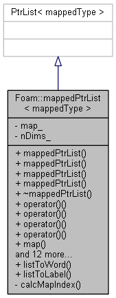

# mappedPtrList

1. [mappedPtrList](#mappedptrlist)
   1. [mappedPtrList.H](#mappedptrlisth)
      1. [Description](#description)
      2. [Include](#include)
      3. [Inherit](#inherit)
      4. [Private data and member functions](#private-data-and-member-functions)
      5. [Constructors and destructor](#constructors-and-destructor)
      6. [Public member functions](#public-member-functions)
         1. [Static member functions](#static-member-functions)
         2. [Access functions](#access-functions)
         3. [Return functions](#return-functions)
         4. [Edit functions](#edit-functions)
   2. [mappedPtrListI.H](#mappedptrlistih)
   3. [mappedPtrList.C](#mappedptrlistc)
      1. [Static Member Functions](#static-member-functions-1)
      2. [Constructors](#constructors)
         1. [Constructor 1](#constructor-1)
         2. [Constructor 2](#constructor-2)
         3. [Constructor 3](#constructor-3)
         4. [Constructor 4](#constructor-4)
      3. [Destructor](#destructor)
      4. [Member functions](#member-functions)
         1. [Private member function](#private-member-function)
            1. [calcMapIndex](#calcmapindex)
         2. [Return functions](#return-functions-1)
            1. [set 1](#set-1)
            2. [set 2](#set-2)
            3. [found 1](#found-1)
            4. [found 2](#found-2)
         3. [Edit functions](#edit-functions-1)
            1. [setMap](#setmap)
            2. [set 1](#set-1-1)
            3. [set 2](#set-2-1)
            4. [set 3](#set-3)
            5. [set 4](#set-4)

## mappedPtrList.H

### Description

Stores **a pointer list**, with a `Map<label>` that takes a label key and returns the index into the list.

    Example

        Lookup  |  Label Key | Index
         0 0 0         0         0
         1 0 0       100         1
         0 1 0        10         2
         0 0 1         1         3
         2 0 0       200         4
         2 1 0       210         5

The operator () is overloaded in order to hide the above mapping.



### Include

```cpp
#include "scalar.H"
#include "PtrList.H"
#include "labelList.H"
#include "Map.H"
```

### Inherit 

```cpp
template <class mappedType>
class mappedPtrList
:
    public PtrList<mappedType>
```

Inherit from `PtrList`.

### Private data and member functions

```cpp
// Private data

    //- Map from the label to its index within the List
    Map<label> map_;

    //- Number of dimensions
    label nDims_;

// Private Member Functions

    //- Returns an element provided the indeces of the order
    label calcMapIndex(std::initializer_list<label> indexes) const;
```

Declare `map_`, `nDims_` and `calcMapIndex`.

### Constructors and destructor

```cpp
// Constructors

    //- Construct from size and labelListList
    mappedPtrList
    (
        const label size,
        const labelListList& indexes
    );

    //- Construct from size and map with initial value for all elements
    mappedPtrList
    (
        const label size,
        const Map<label>& map
    );

    //- Construct from List<mappedType> and labelListList
    mappedPtrList
    (
        const PtrList<mappedType>& initList,
        const labelListList& indexes
    );

    //- Construct from Istream using given Istream constructor class
    template<class INew>
    mappedPtrList(Istream&, const INew&);


//- Destructor
~mappedPtrList();
```

Declare four constructors and one destructor.

### Public member functions

#### Static member functions

```cpp
// Static member functions

    //- Convert a list of labels to a word. {1, 2, 3} -> 123
    static word listToWord(const labelList& lst);

    //- Convert a list of labels to a single label. {0, 2, 3} -> 23
    static label listToLabel
    (
        const labelList& lst,
        const label nDims = 0
    );
```

Declare two functions to convert a list of labels to a word or a single label.

#### Access functions

```cpp
// Access functions

    //- Non-const access to a moment given the list of orders
    template <typename ...ArgsT>
    inline mappedType& operator()(ArgsT ...args);

    //- Const access to a moment given the list of orders
    template <typename ...ArgsT>
    inline const mappedType& operator()(ArgsT ...args) const;

    //- Constant access given a label list
    inline const mappedType& operator()(const labelList& l) const;

    //- Non-constant access given a label list
    inline mappedType& operator()(const labelList& l);

    //- Returns const access to the moment map
    inline const Map<label>& map() const;
```

Declare four overload functions of `()` and one `map` functions to return moment or moment map.

#### Return functions

```cpp
// Return functions

    //- Is index i set
    bool set(const label i) const;

    //- Is label list index set
    bool set(const labelList& l) const;

    //- Is label list index used
    bool found(const labelList& l) const;

    //- Is label list index used
    template <typename ...ArgsT>
    bool found(ArgsT ...args) const;
```

Declare two `set` functions and two `found` functions

#### Edit functions

```cpp
// Edit functions

    //- Set map after PtrList has been constructed
    void setMap(const Map<label>& map);

    //- Set mapped location using pointer
    void set(const label i, mappedType* entry);

    //- Set mapped location using pointer and label list
    void set(const labelList& l, mappedType* entry);

    //- Set mapped location using autoPtr and label list
    void set(const labelList& l, autoPtr<mappedType> entry);

    //- Set mapped location using tmp and label list
    void set(const labelList& l, tmp<mappedType> entry);
```

Declare one `setMap` function and four `set` functions.

## mappedPtrListI.H

```cpp
template <class mappedType>
template <typename ...ArgsT>
mappedType& Foam::mappedPtrList<mappedType>::operator()(ArgsT ...args)
{
    label mapIndex = calcMapIndex({args...});

    return this->operator[](map_[mapIndex]);
}

template <class mappedType>
template <typename ...ArgsT>
const mappedType&
Foam::mappedPtrList<mappedType>::operator()(ArgsT ...args) const
{
    Foam::label mapIndex = calcMapIndex({args...});

    return this->operator[](map_[mapIndex]);
}

template <class mappedType>
const mappedType& Foam::mappedPtrList<mappedType>::operator()
(
    const Foam::labelList& l
) const
{
    return this->operator[](map_[listToLabel(l, nDims_)]);
}

template <class mappedType>
mappedType& Foam::mappedPtrList<mappedType>::operator()
(
    const Foam::labelList& l
)
{
    return this->operator[](map_[listToLabel(l, nDims_)]);
}

template <class mappedType> const Foam::Map<Foam::label>&
Foam::mappedPtrList<mappedType>::map() const
{
    return map_;
}
```

Definition of return functions (four `operator()` and one `map`).

## mappedPtrList.C

### Static Member Functions

```cpp
template <class mappedType>
Foam::word
Foam::mappedPtrList<mappedType>::listToWord(const labelList& lst)
{
    word w;

    forAll(lst, dimi)
    {
        w += Foam::name(lst[dimi]);
    }

    return w;
}


template <class mappedType>
Foam::label
Foam::mappedPtrList<mappedType>::listToLabel
(
    const labelList& lst,
    const label nDims
)
{
    label l = 0;
    label size = max(nDims, lst.size());

    forAll(lst, dimi)
    {
        l += lst[dimi]*pow(scalar(10), size - dimi - 1);
    }

    return l;
}
```

These two functions are same with those in `class mappedList`.

### Constructors

#### Constructor 1

```cpp

```

#### Constructor 2

```cpp

```

#### Constructor 3

```cpp

```

#### Constructor 4

```cpp

```

### Destructor

```cpp
template <class mappedType>
Foam::mappedPtrList<mappedType>::~mappedPtrList()
{}
```

### Member functions

#### Private member function

##### calcMapIndex

```cpp
// same with that in mappedList
template <class mappedType>
Foam::label Foam::mappedPtrList<mappedType>::calcMapIndex
(
    std::initializer_list<Foam::label> indexes
) const
{
    label mapIndex = 0;

    if (indexes.size() > 0)
    {
        for
        (
            std::initializer_list<label>::iterator iter = indexes.begin();
            iter < indexes.end();
            iter++
        )
        {
            label argIndex = std::distance(indexes.begin(), iter);
            mapIndex += (*iter)*pow(scalar(10), nDims_ - argIndex - 1);
        }
    }

    return mapIndex;
}
```

#### Return functions

##### set 1

```cpp
template <class mappedType>
bool Foam::mappedPtrList<mappedType>::set(const label i) const
{
    // use set(i) of PtrList, is set(i) a nullptr or is element i set
    return PtrList<mappedType>::set(i);
}
```

##### set 2

```cpp
template <class mappedType>
bool Foam::mappedPtrList<mappedType>::set(const labelList& l) const
{
    // use set(map_) of PtrList, is set(map_) a list of nullptr or is map_ set
    return PtrList<mappedType>::set(map_[listToLabel(l, nDims_)]);
}
```

##### found 1

```cpp
// if a label key used in mappedPtrList, same with that in mappedList
template <class mappedType>
bool Foam::mappedPtrList<mappedType>::found(const labelList& l) const
{
    if (l.size() > nDims_)
    {
        return false;
    }
    forAllConstIter(Map<label>, map_, iter)
    {
        label x = iter.key();
        if (x == listToLabel(l, nDims_))
        {
            return true;
        }
    }
    return false;
}
```

##### found 2

```cpp
// same with that in mappedList
template <class mappedType>
template <typename ...ArgsT>
bool Foam::mappedPtrList<mappedType>::found(ArgsT...args) const
{
    if (label(std::initializer_list<Foam::label>({args...}).size()) > nDims_)
    {
        return false;
    }
    forAllConstIter(Map<label>, map_, iter)
    {
        label x = iter.key();
        if (x == calcMapIndex({args...}))
        {
            return true;
        }
    }
    return false;
}
```

These two `found` functions are the same with those in `class mappedList`.

#### Edit functions

##### setMap

```cpp
template <class mappedType>
void Foam::mappedPtrList<mappedType>::setMap(const Map<label>& map)
{
    // set map_ as map
    map_ = map;
    // get nDims_
    forAllConstIter(Map<label>, map_, iter)
    {
        label x = iter.key();
        label nD = 0;
        while (x)
        {
            x /= 10;
            nD++;
        }
        nDims_ = max(nDims_, nD);
    }
}
```

Set `map_` and get `nDims_`.

##### set 1

```cpp
template <class mappedType>
void Foam::mappedPtrList<mappedType>::set
(
    const label i,
    mappedType* entry
)
{
    // use set(i, entry) of PtrList to set list
    PtrList<mappedType>::set(i, entry);
}
```

set() of PtrList in `src/OpenFOAM/containers/Lists/PtrList/PtrListI.H`:

```cpp
 template<class T>
 inline Foam::autoPtr<T> Foam::PtrList<T>::set(const label i, T* ptr)
 {
     // backup old ptrs_[i]
     autoPtr<T> old(this->ptrs_[i]);
     // set ptrs_[i] as ptr
     this->ptrs_[i] = ptr;
     // return old ptrs_[i]
     return old;
 }
 ```

 ##### set 2

 ```cpp
template <class mappedType>
void Foam::mappedPtrList<mappedType>::set
(
    const labelList& l,
    mappedType* entry
)
{
    // convert list to label key, then set list
    PtrList<mappedType>::set(map_[listToLabel(l, nDims_)], entry);
}
 ```

 ##### set 3

 ```cpp
 template <class mappedType>
void Foam::mappedPtrList<mappedType>::set
(
    const labelList& l,
    autoPtr<mappedType> entry
)
{
    PtrList<mappedType>::set(map_[listToLabel(l, nDims_)], entry);
}
```

##### set 4

```cpp
template <class mappedType>
void Foam::mappedPtrList<mappedType>::set
(
    const labelList& l,
    tmp<mappedType> entry
)
{
    PtrList<mappedType>::set(map_[listToLabel(l, nDims_)], entry);
}
```