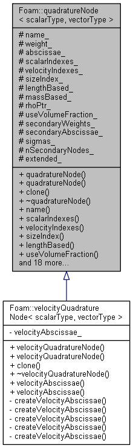

# Quadrature nodes

1. [Quadrature nodes](#quadrature-nodes)
   1. [quadratureNode](#quadraturenode)
      1. [quadratureNode.H](#quadraturenodeh)
         1. [Description](#description)
         2. [Include](#include)
         3. [Template](#template)
         4. [Protected](#protected)
            1. [Typedefs](#typedefs)
            2. [Protected data](#protected-data)
         5. [Public](#public)
            1. [Constructors](#constructors)
            2. [Clone](#clone)
            3. [iNew](#inew)
            4. [Destructor](#destructor)
            5. [Member functions](#member-functions)
               1. [Return protected data](#return-protected-data)
               2. [Return related parameters](#return-related-parameters)
         6. [Final Include](#final-include)
      2. [quadratureNodeI.H](#quadraturenodeih)
      3. [quadratureNodes.H](#quadraturenodesh)
      4. [quadratureNode.C](#quadraturenodec)
         1. [Constructors](#constructors-1)
            1. [Constructor 1](#constructor-1)
            2. [Constructor 2](#constructor-2)
         2. [Destructor](#destructor-1)
         3. [Member functions](#member-functions-1)
            1. [Clone](#clone-1)
            2. [d 1](#d-1)
            3. [d 2](#d-2)
            4. [n 1](#n-1)
            5. [n 2](#n-2)
   2. [velocityQuadratureNode](#velocityquadraturenode)

## quadratureNode

### quadratureNode.H

#### Description

Extended version of the quadrature node, which stores the list of secondary weights and abscissae associated to the primary weight and abscissa, and the sigma parameter.



#### Include

```cpp
#include "fvMesh.H"
#include "PtrList.H"
#include "dictionary.H"
#include "dictionaryEntry.H"
#include "mappedList.H"
```

#### Template

```cpp
template<class scalarType, class vectorType>
class quadratureNode
```

#### Protected

##### Typedefs

```cpp
//- Typedefs

typedef scalarType weightType;
typedef PtrList<PtrList<weightType>> secondaryWeightsType;

typedef scalarType abscissaType;
typedef PtrList<abscissaType> abscissaeType;
typedef PtrList<abscissaeType> secondaryAbscissaeType;

typedef vectorType velocityAbscissaeType;

typedef scalarType sigmaType;
typedef PtrList<sigmaType> sigmasType;
```

##### Protected data

```cpp
// Protected data

    //- Name of the quadrature node
    word name_;

    //- Primary weight of the node
    weightType weight_;

    //- Primary abscissae of the node
    abscissaeType abscissae_;

    //- Indicies of abscissa components
    labelList scalarIndexes_;

    //- Indicies of velocity components
    labelList velocityIndexes_;

    //- Index of size component
    label sizeIndex_;
    // determine internal coordinate
    //- Is the size length based
    bool lengthBased_;

    //- Is the size mass based
    bool massBased_;

    //- Pointer to density field
    const volScalarField* rhoPtr_;

    //- Are weights in volume fraction
    bool useVolumeFraction_;

    //- List of secondary weights of the node
    secondaryWeightsType secondaryWeights_;

    //- List of secondary abscissae of the node
    secondaryAbscissaeType secondaryAbscissae_;

    //- Parameter of the kernel density function used in EQMOM
    sigmasType sigmas_;

    //- Number of secondary nodes
    label nSecondaryNodes_;

    //- Boolean variable to identify extended nodes
    bool extended_;
```

Declare 15 variables.

1. `name_`: Name of the quadrature node;
2. `weight_`: Primary weight of the node;
3. `abscissae_`: Primary abscissae of the node, a PtrList;
4. `scalarIndexes_`: Indicies of abscissa components, a labelList;
5. `velocityIndexes_`: Indicies of velocity components, a label list;
6. `sizeIndex_`: Index of size component;
7. `lengthBased_`: Is the size length based;
8. `massBased_`: Is the size mass based;
9. `rhoPtr_`: Pointer to density field;
10. `useVolumeFraction_`: Are weights in volume fraction;
11. `secondaryWeights_`: List of secondary weights of the node, a PtrList of PtrList;
12. `secondaryAbscissae_`: List of secondary abscissae of the node, a PtrList of PtrList;
13. `sigmas_`: Parameter of the kernel density function used in EQMOM, a PtrList;
14. `nSecondaryNodes_`: Number of secondary nodes;
15. `extended_`: Boolean variable to identify extended nodes.


#### Public

##### Constructors

```cpp
// Constructors

//- Construct from name, mesh and dimensions
quadratureNode
(
    const word& name,
    const word& distributionName,
    const fvMesh& mesh,
    const dimensionSet& weightDimensions,
    const PtrList<dimensionSet>& abscissaeDimensions,
    const wordList& boundaryTypes,
    const bool extended = false,
    const label nSecondaryNodes = 0
);

//- Construct from name, number of secondary nodes, mesh and dimensions
quadratureNode
(
    const word& name,
    const word& distributionName,
    const fvMesh& mesh,
    const dimensionSet& weightDimensions,
    const PtrList<dimensionSet>& abscissaeDimensions,
    const bool extended = false,
    const label nSecondaryNodes = 0
);
```

Declare two constructors.

##### Clone

```cpp
//- Return clone
        autoPtr<quadratureNode<scalarType, vectorType>> clone() const;
```

Declare a `clone` function.

##### iNew

```cpp
//- Return a pointer to a new quadrature node created on freestore
//  from Istream
class iNew
{
    const word distributionName_;
    const fvMesh& mesh_;
    const dimensionSet& weightDimensions_;
    const PtrList<dimensionSet>& abscissaeDimensions_;
    const wordList& boundaryTypes_;
    const bool extended_;
    const label nSecondaryNodes_;

public:
    // constructor for iNew
    iNew
    (
        const word& distributionName,
        const fvMesh& mesh,
        const dimensionSet& weightDimensions,
        const PtrList<dimensionSet>& abscissaeDimensions,
        const wordList& boundaryTypes,
        const bool extended,
        const label nSecondaryNodes
    )
    :
        distributionName_(distributionName),
        mesh_(mesh),
        weightDimensions_(weightDimensions),
        abscissaeDimensions_(abscissaeDimensions),
        boundaryTypes_(boundaryTypes),
        extended_(extended),
        nSecondaryNodes_(nSecondaryNodes)
    {}
    // return a pointer to a new quadratureNode from an input
    autoPtr<quadratureNode<scalarType, vectorType>>
    operator()
    (
        Istream& is
    ) const
    {
        labelList ent(is);
        
        return autoPtr<quadratureNode<scalarType, vectorType>>
        (
            new quadratureNode<scalarType, vectorType>
            (
                "node" + mappedList<scalar>::listToWord(ent),
                distributionName_,
                mesh_,
                weightDimensions_,
                abscissaeDimensions_,
                boundaryTypes_,
                extended_,
                nSecondaryNodes_
            )
        );
    }
};
```

Declare and define a new class `iNew` to return a pointer to a new quadratureNode from an input.

##### Destructor

```cpp
//- Destructor
virtual ~quadratureNode();
```

Declare a destructor.

##### Member functions

Declare 24 member functions.

###### Return protected data

```cpp
//- Return the name of the node, name_
const word& name() const;

//- Return abscissa indexes, scalarIndexes_
const labelList& scalarIndexes() const;

//- Return velocity indexes, velocityIndexes_
const labelList& velocityIndexes() const;

//- Return size index, sizeIndex_
label sizeIndex() const;

//- Is the node length based, lengthBased_
bool lengthBased() const;

//- Is the weight in terms of volume fraction, useVolumeFraction_
bool useVolumeFraction() const;

//- Is the node extended, extended_
bool extended() const;

//- Returns the number of secondary nodes, nSecondaryNodes_
label nSecondaryNodes() const;

//- Const access to the weight of the node, weight_
const weightType& primaryWeight() const;

//- Non-const access to the weight of the node, weight_
weightType& primaryWeight();

//- Const access to the scalar abscissa of the node, abscissae_
const abscissaeType& primaryAbscissae() const;

//- Non-const access to the scalar abscissa of the node, abscissae_
abscissaeType& primaryAbscissae();

//- Const access to the secondary weights of the node, secondaryWeights_
const secondaryWeightsType& secondaryWeights() const;

//- Non-const access to the secondary weights of the node, secondaryWeights_
secondaryWeightsType& secondaryWeights();

//- Const access to the list of secondary abscissae of the node, secondaryAbscissae_
const secondaryAbscissaeType& secondaryAbscissae() const;

//- Non-const access to the list of secondary abscissae of the node, secondaryAbscissae_
secondaryAbscissaeType& secondaryAbscissae();

//- Const access to sigma, sigmas_
const sigmasType& sigmas() const;

//- Non-const access to sigma, sigmas_
sigmasType& sigmas();

//- Const access to the velocity abscissa of the node
virtual const velocityAbscissaeType& velocityAbscissae() const;

//- Non-const access to the velcity abscissa of the node
virtual velocityAbscissaeType& velocityAbscissae();
```

Declare 20 functions to return protected data.

For 5 protected data, two functions are provided for const and non-const access. Functions for `massBased_` and `rhoPtr_` are not declared. Additionally, there are two functions declared returning undefined `velocityAbscissae_`.

###### Return related parameters

```cpp
//- Return the diameter given an abscissae
tmp<volScalarField> d(const volScalarField& x) const;

//- Return the diameter given an abscissae and celli
scalar d(const label celli, const scalar& x) const;

//- Return the number density given an abscissae
tmp<volScalarField> n
(
    const volScalarField& w,
    const volScalarField& x
) const;

//- Return the number density given an abscissae and celli
scalar n(const label celli, const scalar& w, const scalar& x) const;
```

Declare 4 functions to return related parameters.

#### Final Include

```cpp
#ifdef NoRepository
#   include "quadratureNodeI.H"
#   include "quadratureNode.C"
#endif
```

### quadratureNodeI.H

```cpp
template<class scalarType, class vectorType>
const Foam::word&
Foam::quadratureNode<scalarType, vectorType>::name() const
{
    return name_;
}

template<class scalarType, class vectorType>
bool Foam::quadratureNode<scalarType, vectorType>::extended() const
{
    return extended_;
}

template<class scalarType, class vectorType>
const Foam::labelList&
Foam::quadratureNode<scalarType, vectorType>::scalarIndexes() const
{
    return scalarIndexes_;
}

template<class scalarType, class vectorType>
const Foam::labelList&
Foam::quadratureNode<scalarType, vectorType>::velocityIndexes() const
{
    return velocityIndexes_;
}

template<class scalarType, class vectorType>
Foam::label
Foam::quadratureNode<scalarType, vectorType>::sizeIndex() const
{
    return sizeIndex_;
}

template<class scalarType, class vectorType>
bool Foam::quadratureNode<scalarType, vectorType>::lengthBased() const
{
    return lengthBased_;
}

template<class scalarType, class vectorType>
bool Foam::quadratureNode<scalarType, vectorType>::useVolumeFraction() const
{
    return useVolumeFraction_;
}

template<class scalarType, class vectorType>
Foam::label
Foam::quadratureNode<scalarType, vectorType>::nSecondaryNodes() const
{
    return nSecondaryNodes_;
}

template<class scalarType, class vectorType>
const scalarType&
Foam::quadratureNode<scalarType, vectorType>::primaryWeight() const
{
    return weight_;
}

template<class scalarType, class vectorType>
scalarType&
Foam::quadratureNode<scalarType, vectorType>::primaryWeight()
{
    return weight_;
}

template<class scalarType, class vectorType>
const Foam::PtrList<scalarType>&
Foam::quadratureNode<scalarType, vectorType>::primaryAbscissae() const
{
    return abscissae_;
}

template<class scalarType, class vectorType>
Foam::PtrList<scalarType>&
Foam::quadratureNode<scalarType, vectorType>::primaryAbscissae()
{
    return abscissae_;
}

template<class scalarType, class vectorType>
const Foam::PtrList<Foam::PtrList<scalarType>>&
Foam::quadratureNode<scalarType, vectorType>::secondaryWeights() const
{
    if (!extended_)
    {
        FatalErrorInFunction
            << "Attempt to access secondary weights of a quadrature node" << nl
            << "    not of extended type. "
            << abort(FatalError);
    }

    return secondaryWeights_;
}

template<class scalarType, class vectorType>
Foam::PtrList<Foam::PtrList<scalarType>>&
Foam::quadratureNode<scalarType, vectorType>::secondaryWeights()
{
    if (!extended_)
    {
        FatalErrorInFunction
            << "Attempt to access secondary weights of a quadrature node" << nl
            << "    not of extended type. "
            << abort(FatalError);
    }
    return secondaryWeights_;
}

template<class scalarType, class vectorType>
const Foam::PtrList<Foam::PtrList<scalarType>>&
Foam::quadratureNode<scalarType, vectorType>::secondaryAbscissae() const
{
    if (!extended_)
    {
        FatalErrorInFunction
            << "Attempt to access secondary abscissae of a quadrature" << nl
            << "   node not of extended type. "
            << abort(FatalError);
    }

    return secondaryAbscissae_;
}

template<class scalarType, class vectorType>
Foam::PtrList<Foam::PtrList<scalarType>>&
Foam::quadratureNode<scalarType, vectorType>::secondaryAbscissae()
{
    if (!extended_)
    {
        FatalErrorInFunction
            << "Attempt to access secondary abscissae of a quadrature" << nl
            << "   node not of extended type. "
            << abort(FatalError);
    }

    return secondaryAbscissae_;
}

template<class scalarType, class vectorType>
const Foam::PtrList<scalarType>&
Foam::quadratureNode<scalarType, vectorType>::sigmas() const
{
    if (!extended_)
    {
        FatalErrorInFunction
            << "Attempt to access sigma field of a quadrature node not" << nl
            << "   of extended type. "
            << abort(FatalError);
    }

    return sigmas_;
}

template<class scalarType, class vectorType>
Foam::PtrList<scalarType>&
Foam::quadratureNode<scalarType, vectorType>::sigmas()
{
    if (!extended_)
    {
        FatalErrorInFunction
            << "Attempt to access sigma field of a quadrature node not" << nl
            << "   of extended type. "
            << abort(FatalError);
    }

    return sigmas_;
}

template<class scalarType, class vectorType>
const vectorType&
Foam::quadratureNode<scalarType, vectorType>::velocityAbscissae() const
{
    FatalErrorInFunction
        << "Attempt to access velocity abscissa of a quadrature node" << nl
        << "    with no scalar abscissa. "
        << abort(FatalError);
    // return a null pointer 
    return const_cast<const vectorType&>(velocityAbscissaeType::null());
}

template<class scalarType, class vectorType>
vectorType&
Foam::quadratureNode<scalarType, vectorType>::velocityAbscissae()
{
    FatalErrorInFunction
        << "Attempt to access velocity abscissa of aquadrature node" << nl
        << "    with no velocity abscissa. "
        << abort(FatalError);
    // return a null pointer    
    return const_cast<vectorType&>(velocityAbscissaeType::null());
}
```

Definition of 20 functions returning protected data.

### quadratureNodes.H

```cpp
typedef quadratureNode<volScalarField, volVectorField>  volScalarNode;
typedef quadratureNode<surfaceScalarField, surfaceVectorField>
    surfaceScalarNode;

typedef velocityQuadratureNode<volScalarField, volVectorField> volVelocityNode;
typedef velocityQuadratureNode<surfaceScalarField, surfaceVectorField> 
    surfaceVelocityNode;
```

Rename types:

* volScalarNode
* surfaceScalarNode
* volVelocityNode
* surfaceVelocityNode

### quadratureNode.C

Define 2 constructors, 1 destructor, 1 clone, and 4 member function returning related parameters.

#### Constructors

##### Constructor 1

##### Constructor 2

#### Destructor

#### Member functions

##### Clone

```cpp
template<class scalarType, class vectorType>
Foam::autoPtr<Foam::quadratureNode<scalarType, vectorType>>
Foam::quadratureNode<scalarType, vectorType>::clone() const
{
    notImplemented("quadratureNode::clone() const");
    return nullptr;
}
```

Do not implement clone.

##### d 1

```cpp
template<class scalarType, class vectorType>
Foam::tmp<Foam::volScalarField>
Foam::quadratureNode<scalarType, vectorType>::d
(
    const volScalarField& x
) const
{
    // if sizeIndex_ = -1, return d = 0
    if (sizeIndex_ == -1)
    {
        return tmp<volScalarField>
        (
            new volScalarField
            (
                IOobject
                (
                    "d",
                    weight_.time().timeName(),
                    weight_.mesh(),
                    IOobject::NO_READ,
                    IOobject::NO_WRITE,
                    false
                ),
                weight_.mesh(),
                dimensionedScalar("d", dimLength, Zero)
            )
        );
    }
    // if lengthBased_
    if (lengthBased_)
    {
        // return d = x
        return x;
    }
    // if massBased and rnoPtr_ is not empty
    if (massBased_ && rhoPtr_)
    {
        // return d = (x * 6.0 / (PI * rho)) ^ (1 / 3)
        return cbrt(x*6.0/(Foam::constant::mathematical::pi*(*rhoPtr_)));
    }
    // return d = (x * 6.0 / PI) ^ (1 / 3)
    return cbrt(x*6.0/Foam::constant::mathematical::pi);
}
```

For empty `sizeIndex_`:

$$
d = 0
$$

For `lengthBased_`

$$
d = x
$$

For `massBased_` and $\rho$ exists:

$$
d = \sqrt[3]{\frac{6x}{\pi \rho}}
$$

Else:

$$
d = \sqrt[3]{\frac{6x}{\pi}}
$$

##### d 2

```cpp
template<class scalarType, class vectorType>
Foam::scalar Foam::quadratureNode<scalarType, vectorType>::d
(
    const label celli,
    const scalar& x
) const
{
    // similar to above
    if (sizeIndex_ == -1)
    {
        return 0.0;
    }
    if (lengthBased_)
    {
        return x;
    }

    if (massBased_ && rhoPtr_)
    {
        return cbrt(x*6.0/(Foam::constant::mathematical::pi*(*rhoPtr_)[celli]));
    }
    return cbrt(x*6.0/Foam::constant::mathematical::pi);
}
```

##### n 1

```cpp
template<class scalarType, class vectorType>
Foam::tmp<Foam::volScalarField>
Foam::quadratureNode<scalarType, vectorType>::n
(
    const volScalarField& w,
    const volScalarField& x
) const
{
    // if use volume fraction
    if (!useVolumeFraction_)
    {
        // return n = w
        return w;

    }
    // declare v
    tmp<volScalarField> v;
    if (massBased_ && rhoPtr_)
    {
        // v = x / rho
        v = x/(*rhoPtr_);
    }
    else if (lengthBased_)
    {
        // v = x^3
        v = pow3(x);
    }
    else
    {
        // v = x
        v = x;
    }

    v.ref().max(pow3(SMALL));
    // n = w / v
    return w/v;
}
```

For volume fraction:

$$
n = w
$$

For `maseBased_` and $\rho$ exists:

$$
n = \frac{\rho w}{x}
$$

For `lengthBased_`:

$$
n = \frac{w}{x^3}
$$

Else:

$$
n = \frac{w}{x}
$$

##### n 2

```cpp
template<class scalarType, class vectorType>
Foam::scalar Foam::quadratureNode<scalarType, vectorType>::n
(
    const label celli,
    const scalar& w,
    const scalar& x
) const
{
    // similar to above
    if (!useVolumeFraction_)
    {
        return w;
    }

    scalar v = pow3(SMALL);

    if (massBased_ && rhoPtr_)
    {
        v = max(v, x/(*rhoPtr_)[celli]);
    }
    else if (lengthBased_)
    {
        v = max(v, pow3(x));
    }
    else
    {
        v = max(v, x);
    }

    return w/v;
}
```

## velocityQuadratureNode