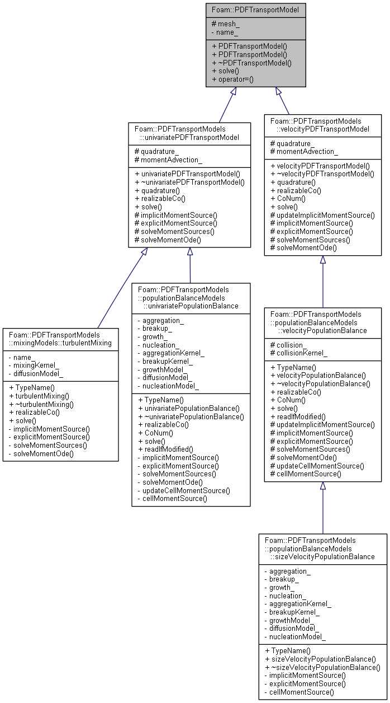

# PDF Transport Model

1. [PDF Transport Model](#pdf-transport-model)
   1. [PDFTransportModel](#pdftransportmodel)
      1. [Description](#description)
      2. [PDFTransportModel.H](#pdftransportmodelh)
      3. [PDFTransportModel.C](#pdftransportmodelc)
   2. [univariatePDFTransportModel](#univariatepdftransportmodel)
      1. [Description](#description-1)
      2. [univariatePDFTransportModel.H](#univariatepdftransportmodelh)
      3. [univariatePDFTransportModel.C](#univariatepdftransportmodelc)
   3. [velocityPDFTransportModel](#velocitypdftransportmodel)
      1. [Description](#description-2)
      2. [velocityPDFTransportModel.H](#velocitypdftransportmodelh)
      3. [velocityPDFTransportModel.C](#velocitypdftransportmodelc)

## PDFTransportModel

### Description

Abstract class for the run-time selection of the PDF transport model.



### PDFTransportModel.H

```cpp
    // Private data

        //- Name of the PDFTransportModel
        const word name_;


protected:

    // Protected data

        //- Constant reference to the mesh
        const fvMesh& mesh_;
```

Declare private and protected data.

```cpp
    // Member Functions

        //- Solve PDF transport equation
        virtual void solve() = 0;
```

Declare public member functionis.

### PDFTransportModel.C

```cpp
Foam::PDFTransportModel::PDFTransportModel
(
    const word& name,
    const dictionary& dict,
    const fvMesh& mesh
)
:
    name_(name),
    mesh_(mesh)
{}

Foam::PDFTransportModel::~PDFTransportModel()
{}
```

Define constructor and destructor.

## univariatePDFTransportModel

### Description

### univariatePDFTransportModel.H

### univariatePDFTransportModel.C

## velocityPDFTransportModel

### Description

### velocityPDFTransportModel.H

### velocityPDFTransportModel.C