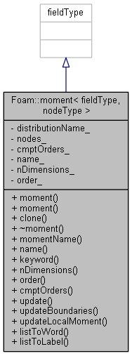

# Moments

1. [Moments](#moments)
   1. [Moment](#moment)
      1. [Description](#description)
      2. [moment.H](#momenth)
         1. [Include](#include)
         2. [Head](#head)
         3. [Private data](#private-data)
         4. [Public variables and member functions](#public-variables-and-member-functions)
            1. [Convert](#convert)
            2. [Constructors and clone](#constructors-and-clone)
            3. [class iNew](#class-inew)
            4. [Destructor](#destructor)
            5. [Member functions](#member-functions)
               1. [Member functions for access to private data](#member-functions-for-access-to-private-data)
               2. [Member functions to edit the class](#member-functions-to-edit-the-class)
         5. [ifdef](#ifdef)
      3. [momentI.H](#momentih)
      4. [moments.H](#momentsh)
      5. [moment.C](#momentc)
         1. [Static member functions](#static-member-functions)
         2. [Constructors](#constructors)
            1. [Constructor 1](#constructor-1)
            2. [Constructor 2](#constructor-2)
         3. [Destructor](#destructor-1)
         4. [Member functions](#member-functions-1)
            1. [clone()](#clone)
            2. [update()](#update)

## Moment

### Description

Stores a moment of a distribution function with arbitrary dimensionality.



### moment.H

#### Include

```cpp
#include "mappedPtrList.H"
#include "quadratureNodes.H"
#include "volFields.H"
#include "labelList.H"
```

#### Head

```cpp
template <class fieldType, class nodeType>
class moment
:
    public fieldType
```

It is a class template.

#### Private data

```cpp
    //- Name of the distribution associated to the moment
    const word distributionName_;

    //- Reference to the quadrature nodes
    const autoPtr<mappedPtrList<nodeType>>& nodes_;

    //- Order of each dimension of the moment
    const labelList cmptOrders_;

    //- Name of the moment
    const word name_;

    //- Number of dimensions of the distribution function
    const label nDimensions_;

    //- Overall order of the moment
    const label order_;
```

Declare private data:

* `distributionName_`: Name of the distribution associated to the moment;
* `nodes_`: Reference to the quadrature nodes;
* `cmptOrders_`: Order of each dimension of the moment;
* `name_`: Name of the moment;
* `nDimensions_`: Number of dimensions of the distribution function;
* `order_`: Overall order of the moment.

#### Public variables and member functions

##### Convert

```cpp
    //- Convert a list of labels to a word. {1, 2, 3} -> 123
    static word listToWord(const labelList& lst);

    //- Convert a list of labels to a single label. {0, 2, 3} -> 23
    static label listToLabel(const labelList& lst);
```

Declare two member functions that convert a list of label to a word (`listToWord`) or a single label(`listToLabel`).

##### Constructors and clone

```cpp
    // Constructors

        //- Construct from a list of orders of each dimension of the moment
        //  and the quadrature nodes
        moment
        (
            const word& distributionName,
            const labelList& cmptOrders,
            const fvMesh& mesh,
            const autoPtr<mappedPtrList<nodeType>>& nodes
        );

        //- Construct from name, orders, and quadrature nodes
        moment
        (
            const word& distributionName,
            const labelList& cmptOrders,
            const autoPtr<mappedPtrList<nodeType>>& nodes,
            const fieldType& initMoment,
            const word momentSetName = word::null
        );
        
        //- Return clone
        autoPtr<moment> clone() const;
```

Declare two constructors.

##### class iNew

```cpp
        //- Return a pointer to a new moment created on freestore
        //  from Istream
        class iNew
        {
            // private data
            const word& distributionName_;
            const fvMesh& mesh_;
            const autoPtr<mappedPtrList<nodeType>>& nodes_;

        public:
            // constructor
            iNew
            (
                const word& distributionName,
                const fvMesh& mesh,
                const autoPtr<mappedPtrList<nodeType>>& nodes
            )
            :
                distributionName_(distributionName),
                mesh_(mesh),
                nodes_(nodes)
            {}
            // return a pointer for a new moment based on input
            autoPtr<moment<fieldType, nodeType>> operator()(Istream& is) const
            {
                labelList ent(is);
                return autoPtr<moment<fieldType, nodeType>>
                (
                    new moment<fieldType, nodeType>
                    (
                        distributionName_,
                        ent,
                        mesh_,
                        nodes_
                    )
                );
            }
        };
```

Define a new class `iNew` to return a pointer to a new moment created on freestore from Istream.

##### Destructor

```cpp
    //- Destructor
    ~moment();
```

Declare a destructor.

##### Member functions

```cpp
    // Member Functions

            //- Creates the name of the moment
            word momentName
            (
                const word& momentSetName,
                const word& order,
                const word& distributionName
            )
            {
                word tmpName = IOobject::groupName(momentSetName, order);
                return IOobject::groupName(tmpName, distributionName);
            }
```

Declare and define `momentName` to Creates the name of the moment.

###### Member functions for access to private data

```cpp
        // Access

            //- Return the name of the moment
            inline const word& name() const;

            //- Return the name of the moment
            inline const word& keyword() const;

            //- Return the dimensionality of the distribution
            inline label nDimensions() const;

            //- Return the overall order of the moment
            inline label order() const;

            //- Return the order of each dimension
            inline const labelList& cmptOrders() const;
```

Declare inline function to access to private data:

* `name()`: Return the name of the moment;
* `keyword()`: Return the name of the moment;
* `nDimensions()`: Return the dimensionality of the distribution;
* `order()`: Return the overall order of the moment;
* `cmptOrders()`: Return the order of each dimension.

###### Member functions to edit the class

```cpp
        // Edit

            //- Update the moment from the quadrature nodes
            void update();

            //- Update the moment from the quadrature nodes
            //  on boundaries
            void updateBoundaries();

            //- Update the moment from the quadrature nodes in a single element
            void updateLocalMoment(label elemi);
```

Declare member functions to edit the class:

* `updates()`: Update the moment from the quadrature nodes;
* `updateBoundaries()`: Update the moment from the quadrature nodes on boundaries;
* `updateLocalMoment(label)`:  Update the moment from the quadrature nodes in a single element.

#### ifdef

```cpp
#ifdef NoRepository
#   include "momentI.H"
#   include "moment.C"
#endif
```

Include `momentI.H` and `moment.C`

### momentI.H

```cpp
template <class fieldType, class nodeType>
const Foam::word& Foam::moment<fieldType, nodeType>::name() const
{
    return name_;
}

template <class fieldType, class nodeType>
const Foam::word& Foam::moment<fieldType, nodeType>::keyword() const
{
    return name();
}

template <class fieldType, class nodeType>
Foam::label Foam::moment<fieldType, nodeType>::nDimensions() const
{
    return nDimensions_;
}

template <class fieldType, class nodeType>
Foam::label Foam::moment<fieldType, nodeType>::order() const
{
    return order_;
}

template <class fieldType, class nodeType>
const Foam::labelList&
Foam::moment<fieldType, nodeType>::cmptOrders() const
{
    return cmptOrders_;
}
```

Define the function template for member functions returning private data.

### moments.H

```cpp
typedef moment<volScalarField, volScalarNode> volScalarMoment;
typedef moment<surfaceScalarField, surfaceScalarNode> surfaceScalarMoment;

typedef moment<volScalarField, volVelocityNode> volVelocityMoment;
typedef moment<surfaceScalarField, surfaceVelocityNode> surfaceVelocityMoment;
```

Rename moment types:

* volScalarMoment;
* surfaceScalarMoment;
* volVelocityMoment;
* surfaceVelocityMoment.

### moment.C

Static member functions, constructors, destructor and member functions for access and to edit etc. are defined in `moment.C`

#### Static member functions

```cpp
template <class fieldType, class nodeType>
Foam::word
Foam::moment<fieldType, nodeType>::listToWord(const labelList& lst)
{
    word w;

    forAll(lst, dimi)
    {
        w += Foam::name(lst[dimi]);
    }

    return w;
}

template <class fieldType, class nodeType>
Foam::label
Foam::moment<fieldType, nodeType>::listToLabel(const labelList& lst)
{
    label l = 0;

    forAll(lst, dimi)
    {
        l += lst[dimi]*pow(scalar(10), lst.size() - dimi - 1);
    }

    return l;
}
```

Convert a list of labels to a word or a single label.

#### Constructors

##### Constructor 1

```cpp
template <class fieldType, class nodeType>
Foam::moment<fieldType, nodeType>::moment
(
    const word& distributionName,
    const labelList& cmptOrders,
    const fvMesh& mesh,
    const autoPtr<mappedPtrList<nodeType>>& nodes
)
:
    // create field type
    fieldType
    (
        IOobject
        (
            momentName("moment", listToWord(cmptOrders), distributionName),
            mesh.time().timeName(),
            mesh,
            IOobject::MUST_READ,
            IOobject::AUTO_WRITE
        ),
        mesh
    ),
    // initialize private data with arguments
    distributionName_(distributionName),
    nodes_(nodes),
    cmptOrders_(cmptOrders),
    name_(momentName("moment", listToWord(cmptOrders_), distributionName_)),
    nDimensions_(cmptOrders_.size()),
    order_(sum(cmptOrders_))
{}
```

Construct from a list of orders of each dimension of the moment and the quadrature nodes.

##### Constructor 2

```cpp
template <class fieldType, class nodeType>
Foam::moment<fieldType, nodeType>::moment
(
    const word& distributionName,
    const labelList& cmptOrders,
    const autoPtr<mappedPtrList<nodeType>>& nodes,
    const fieldType& initMoment,
    const word momentSetName
)
:
    // initialize private data
    fieldType
    (
        momentName
        (
            "moment" + momentSetName,
            listToWord(cmptOrders),
            distributionName
        ),
        initMoment
    ),
    distributionName_(distributionName),
    nodes_(nodes),
    cmptOrders_(cmptOrders),
    name_
    (
        momentName
        (
            "moment" + momentSetName,
            listToWord(cmptOrders),
            distributionName
        )
    ),
    nDimensions_(cmptOrders_.size()),
    order_(sum(cmptOrders_))
{}
```

Construct from name, orders, and quadrature nodes.

#### Destructor

```cpp
template <class fieldType, class nodeType>
Foam::moment<fieldType, nodeType>::~moment()
{}
```

#### Member functions

##### clone()

```cpp
template <class fieldType, class nodeType>
Foam::autoPtr<Foam::moment<fieldType, nodeType>>
Foam::moment<fieldType, nodeType>::clone() const
{
    NotImplemented;
    return nullptr;
}
```

This function is not implemented and return a null pointer.

##### update()
