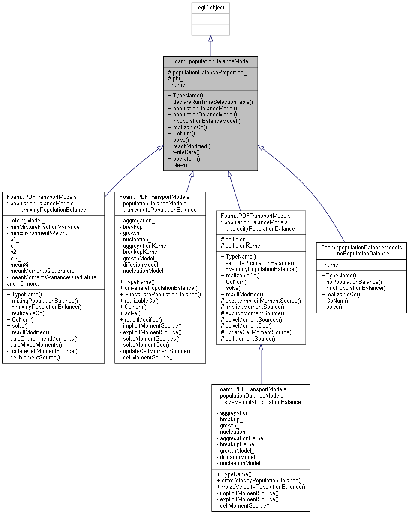
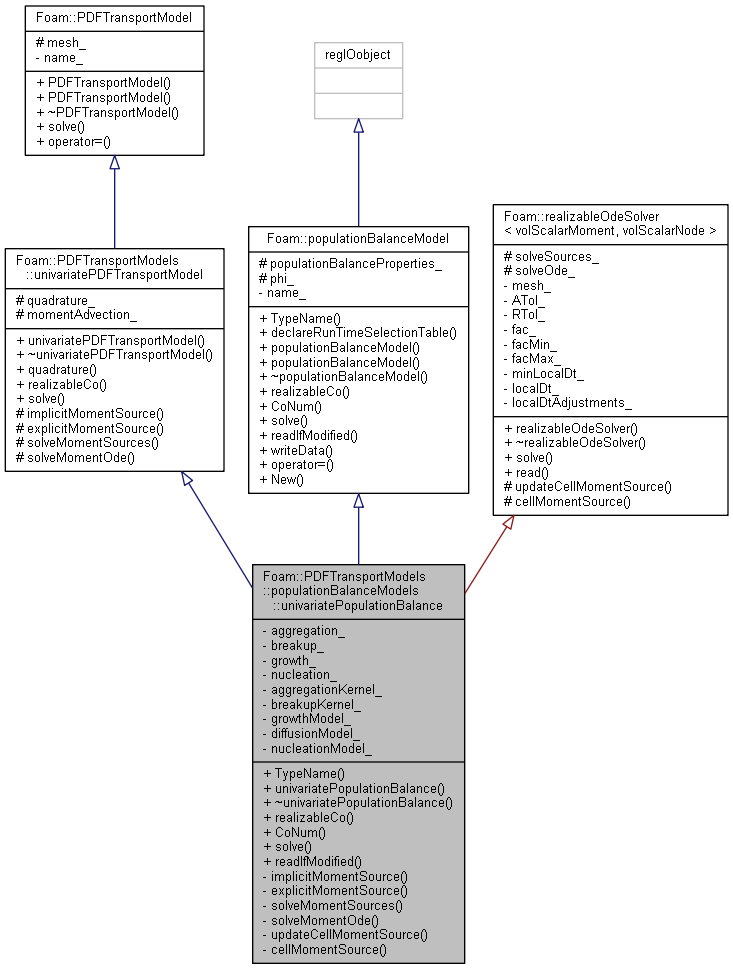

# Population Balance Models

1. [Population Balance Models](#population-balance-models)
   1. [populationBalanceModel](#populationbalancemodel)
      1. [Description](#description)
      2. [populationBalanceModel.H](#populationbalancemodelh)
      3. [populationBalanceModel.C](#populationbalancemodelc)
      4. [newPopulationBalanceModel.C](#newpopulationbalancemodelc)
   2. [populationBalanceSubModels](#populationbalancesubmodels)
   3. [noPopulationBalance](#nopopulationbalance)
      1. [Description](#description-1)
      2. [noPopulationBalance.H](#nopopulationbalanceh)
      3. [noPopulationBalance.C](#nopopulationbalancec)
   4. [univariatePopulationBalance](#univariatepopulationbalance)
      1. [Description](#description-2)
      2. [univariatePopulationBalance.H](#univariatepopulationbalanceh)
      3. [univariatePopulationBalance.C](#univariatepopulationbalancec)
   5. [mixingPopulationBalance](#mixingpopulationbalance)
      1. [mixingPopulationBalance.H](#mixingpopulationbalanceh)
      2. [mixingPopulationBalance.C](#mixingpopulationbalancec)
   6. [velocityPopulationBalance](#velocitypopulationbalance)
      1. [velocityPopulationBalance.H](#velocitypopulationbalanceh)
      2. [velocityPopulationBalance.C](#velocitypopulationbalancec)
   7. [sizeVelocityPopulationBalance](#sizevelocitypopulationbalance)
      1. [sizeVelocityPopulationBalance.H](#sizevelocitypopulationbalanceh)
      2. [sizeVelocityPopulationBalance.C](#sizevelocitypopulationbalancec)

## populationBalanceModel

### Description

Abstract class for the run-time selection of the population balance model. Base class for mixingPopulationBalance, univariatePopulationBalance, velocityPopulationBalance, noPopulationBalance, and sizeVelocityPopulationBalance.



### populationBalanceModel.H

```cpp
    // Private data

        //- Name of the populationBalanceModel
        const word name_;


protected:

    // Protected data

        //- Reference to populationBalanceProperties
        //  Non-const so ode solver can read on modification
        IOdictionary& populationBalanceProperties_;

        //- Fluid-phase face-normal velocity
        const surfaceScalarField& phi_;
```

Declare private and protected data.

```cpp
    // Member Functions

        //- Return the maximum Courant number ensuring moment realizability
        virtual scalar realizableCo() const = 0;

        //- Return the courant number based on abscissae
        virtual scalar CoNum() const = 0;

        //- Solve population balance equation
        virtual void solve() = 0;
```

Declare public member functions.

### populationBalanceModel.C

```cpp
Foam::populationBalanceModel::populationBalanceModel
(
    const word& name,
    const dictionary& dict,
    const surfaceScalarField& phi
)
:
    regIOobject
    (
        IOobject
        (
            IOobject::groupName("populationBalance", name),
            phi.mesh().time().constant(),
            phi.mesh(),
            IOobject::MUST_READ_IF_MODIFIED,
            IOobject::NO_WRITE,
            true
        )
    ),
    name_(name),
    populationBalanceProperties_
    (
        phi.mesh().lookupObjectRef<IOdictionary>("populationBalanceProperties")
    ),
    phi_(phi)
{}
```

Defination of constructor.

### newPopulationBalanceModel.C

```cpp
Foam::autoPtr<Foam::populationBalanceModel>
Foam::populationBalanceModel::New
(
    const word& name,
    const dictionary& dict,
    const surfaceScalarField& phi
)
{
    // read population balance model type from dict
    word populationBalanceModelType(dict.lookup("populationBalanceModel"));

    Info<< "Selecting populationBalanceModel "
        << populationBalanceModelType << endl;

    dictionaryConstructorTable::iterator cstrIter =
        dictionaryConstructorTablePtr_->find(populationBalanceModelType);

    // if it cannot be found, output error message
    if (cstrIter == dictionaryConstructorTablePtr_->end())
    {
        FatalErrorInFunction
            << "Unknown populationBalanceModelType type "
            << populationBalanceModelType << endl << endl
            << "Valid populationBalanceModelType types are :" << endl
            << dictionaryConstructorTablePtr_->sortedToc()
            << abort(FatalError);
    }

    // if it is found, return a pointer
    return
        autoPtr<populationBalanceModel>
        (
            cstrIter()
            (
                name,
                dict.subDict(populationBalanceModelType + "Coeffs"),
                phi
            )
        );
}
```

Allocate space for a new populationBalanceModel object.

## populationBalanceSubModels

## noPopulationBalance

### Description

Disables the solution of the population balance model.

### noPopulationBalance.H

```cpp
    // Member Functions

        //- Return the maximum Courant number ensuring moment realizability
        virtual scalar realizableCo() const;

        //- Return the courant number based on abscissae
        virtual scalar CoNum() const;
```

Declare public member functions.

### noPopulationBalance.C

```cpp
Foam::scalar
Foam::populationBalanceModels::noPopulationBalance::realizableCo
() const
{
    return 1.0;
}
```

`realizableCo()` return 1.0.

```cpp
Foam::scalar
Foam::populationBalanceModels::noPopulationBalance::CoNum
() const
{
    return 0.0;
}
```

`CoNum()` return 0.0.

```cpp
void Foam::populationBalanceModels::noPopulationBalance::solve()
{
    return;
}
```

`solver()` is void.

## univariatePopulationBalance

### Description

Solve a univariate population balance equation with the extended quadrature method of moments.



### univariatePopulationBalance.H

### univariatePopulationBalance.C

## mixingPopulationBalance

### mixingPopulationBalance.H

### mixingPopulationBalance.C

## velocityPopulationBalance

### velocityPopulationBalance.H

### velocityPopulationBalance.C

## sizeVelocityPopulationBalance

### sizeVelocityPopulationBalance.H

### sizeVelocityPopulationBalance.C