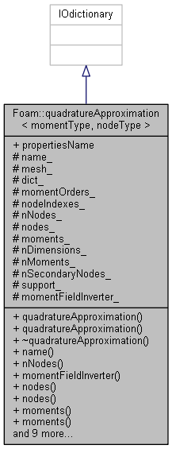

# Quadrature Approximations

1. [Quadrature Approximations](#quadrature-approximations)

## quadratureApproximation

### Description

Provides storage for the moments and the corresponding quadrature approximation of a distribution function. Methods to update the moments and the quadrature approximation are provided.



### quadratureApproximation.H

```cpp
protected:
    // Protected data

        typedef momentFieldSet<momentType, nodeType> momentFieldSetType;

        //- Name of the quadrature approximation
        const word name_;

        //- Reference to the mesh
        const fvMesh& mesh_;

        const dictionary& dict_;

        //- Moment orders used to map moments
        const labelListList momentOrders_;

        //- Node indexes used to map nodes
        const labelListList nodeIndexes_;

        //- Number of nodes in each direction
        labelList nNodes_;

        //- AutoPtr to the mappedPtrList of quadrature nodes
        autoPtr<mappedPtrList<nodeType>> nodes_;

        //- List of moments
        momentFieldSetType moments_;

        //- Dimensionality of the distribution function
        const label nDimensions_;

        //- Number of moments
        const label nMoments_;

        //- Number of secondary nodes
        const label nSecondaryNodes_;

        //- Support of the distribution function
        word support_;

        //- Extended moment inversion method
        autoPtr<fieldMomentInversion> momentFieldInverter_;
```

Declare protected data: 

* a moment type `momentFieldsSet` containing moment type and node type;
* name of the quadrature approximation `name_`;
* mesh `mesh_`;
* dictionary `dict_`;
* a list `momentOrders` containing moment orders;
* a list `nodeIndes_` containing node indexes
* a number `nNodes_` representing number of nodes in each directions;
* an AutoPtr for nodes `nodes_`;
* a List of moments `moments_`;
* Dimensionality of the distribution function `nDimensions_`;
* number of moments `nMoments_`;
* number of secondary nodes `nSecondaryNodes_`;
* support of the distribution function `suport_`;
* an AutoPtr for extended moment inversion method `momentFieldInverter_`

```cpp
public:

    //- Default name of the phase properties dictionary
    static const word propertiesName;
```

Declare name of the phase properties dictionary.

```cpp
    // Constructors

        //- Construct from mesh
        quadratureApproximation
        (
            const word& name,
            const fvMesh& mesh,
            const word& support
        );

        //- Construct from dictionary name, name, momentFieldSet
        //  Moment fields in the momentFieldSet passed as reference are
        //  used to initialise the local copy of moments. Inversion on
        //  creation is optional.
        quadratureApproximation
        (
            const word& dictName,
            const word& name,
            const momentFieldSetType& mFieldSet,
            bool calcQuadratureOnCreation = false
        );

    //- Destructor
    virtual ~quadratureApproximation();
```

Declare constructors and destructors.

```cpp
    // Member Functions

        // Access

            //- Return name
            inline const word name() const;

            //- Return the nmber of nodes in each direction
            const labelList& nNodes() const;

            //- Extended moment inversion method
            inline fieldMomentInversion& momentFieldInverter();

            //- Const access to the nodes
            inline const mappedPtrList<nodeType>& nodes() const;

            //- Non-Const access to the nodes
            inline mappedPtrList<nodeType>& nodes();

            //- Const access to the moments
            inline const momentFieldSetType& moments() const;

            //- Non-const access to the moments
            inline momentFieldSetType& moments();

            //- Return the number of dimensions in the distribution
            inline label nDimensions() const;

            //- Return the number of moments
            inline label nMoments() const;

            //- Return moment orders
            inline const labelListList& momentOrders() const;

            //- return node indexes
            inline const labelListList& nodeIndexes() const;
```

Declare public member functions:

* `name()`: return `name_`;
* `nNodes`: return `nNodes_`;
* `momentFieldInverter()`: Extended moment inversion method;
* `nodes() const`: Const access to the `nodes_`;
* `nodes()`: Non-const access to the `nodes_`;
* `moments() const`: Const access to the `moments_`;
* `moments()`: Non-const access to the `moments_`;
* `nDimensions()`: return `nDimensions_`;
* `nMoments()`: return `nMoments_`;
* `momentOrders()`: return `momentOrders_`;
* `nodeIndexes()`: return `nodeIndex_`

```cpp

        // Edit

            //- Recalculate the quadrature nodes from the moments
            void updateQuadrature();

            //- Recalculate the quadrature nodes from the moments
            //  on boundaries
            void updateBoundaryQuadrature();
            //- Recalculate the moments from the quadrature nodes
            void updateMoments();

            //- Recalculate moments in the specified cell
            void updateLocalMoments(label celli);

            //- Recalculate the quadrature nodes from the moments in the
            //  specified cell
            bool updateLocalQuadrature
            (
                label celli,
                bool fatalErrorOnFailedRealizabilityTest = true
            );
```

Declare public member function about updating the class.

* `updateQuadrature()`: Recalculate the quadrature nodes from the moments;
* `updateBoundaryQuadrature()`: Recalculate the quadrature nodes from the moments on boundaries;
* `updateMoments()`: Recalculate the moments from the quadrature nodes;
* `updateLocalMoments(label celli)`: Recalculate moments in the specified cell;
* `bool updateLocalQuadrature(label, bool)`: Recalculate the quadrature nodes from the moments in the specified cell.

```cpp
#ifdef NoRepository
#   include "quadratureApproximationI.H"
#   include "quadratureApproximation.C"
#endif
```

Include `quadratureApproximationI.H` and `quadratureApproximation.C`

### quadratureApproximationI.H

### quadratureApproximations.H

### quadratureApproximation.C